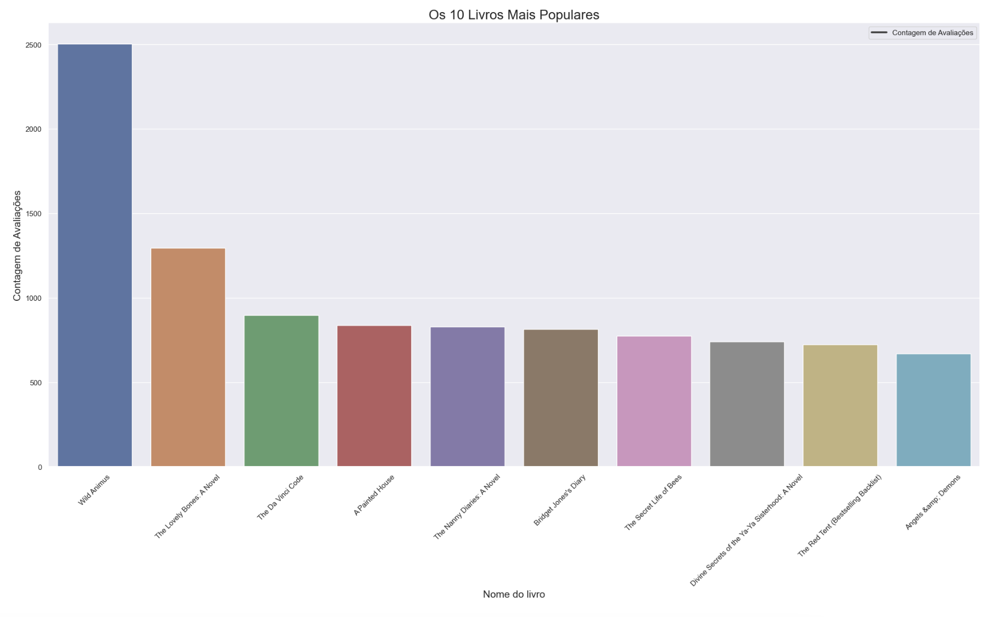

# Recommendation System Project 💡

With platforms with thousands of items, how can you connect users to the right content that will be relevant? To answer this question, recommendation systems emerge, a solution to personalize the content presented to users.

And when used well, recommendation systems bring significant results. Netflix, for example, generates $1 billion in profit per year, being the mechanism behind 80% of the content viewed on the platform.

But it doesn't just stop there. E-commerce and other forms of electronic commerce such as marketplaces, social networks and search engines like Google also make use of the resource. All of this with the aim of providing a unique browsing experience for each user and at the same time increasing conversions.

I built a recommendation system for recommending products in an E-commerce ( Amazon ), but the focus is on the book recommendation system.

Data for analysis were made available within the data competitions platform [Kaggle](https://www.kaggle.com/datasets/arashnic/book-recommendation-dataset/data).

# 1.0 Business Problem

- With the increase in the book market and the diversification of readers' tastes, it becomes challenging to provide reading recommendations that are appropriate and relevant to each user. A personalized recommendation model can increase user satisfaction, boost sales and build customer loyalty by offering suggestions that are aligned with their individual preferences.
- Using machine learning algorithms and recommendation techniques, it will be possible to analyze the behavior and preferences of each user based on their purchase history and interactions with books. The personalized recommendation model will consider this information to make book suggestions that are highly relevant and interesting for each user.
- The solution will consist of creating a personalized book recommendation model, which will analyze each user's purchase history and preferences to offer personalized suggestions.

Create a personalized book recommendation model to provide accurate and relevant suggestions to users.

# 2.0 Business Assumptions

The sample dataset summarizes the behavior of 3,150 Amazon customers.

## 2.1 Data Description

Variável | Definição
------------ | -------------
ISBN | Código|
Book-Title | Nome do livro|
Book-Author | Autor do livro|
Year-Of-Publication | O ano que ele foi publicado|
Publisher | Editora|
Image-URL-S | URL|
Image-URL-M | URL|
Image-URL-L | URL|

# 3.0 Solution Strategy

# 4.0 Some insights

# 5.0 Machine Learning

By utilizing machine learning algorithms, we can create systems that offer personalized suggestions to users, helping them discover new products and increasing customer engagement.

Two Machine Learning techniques were applied:

- Nearest Neighbors: It is an unsupervised algorithm, where it will learn using distance, that is, it will calculate the distance to learn this model.
- Cossine Similarity: It is a metric commonly used in the context of recommendation systems to calculate the similarity between two vectors of items or users.

# 6.0 Results

# 7.0 Deployment

Streamlit Cloud.

# 8.0 Conclusions

In this project, we seek to solve the challenge of offering accurate and relevant reading recommendations to users, considering the growth of the book market and the diversification of the reading public. By implementing a personalized book recommendation model, it was possible to create a solution that provides personalized suggestions to users, increasing their satisfaction and engagement with the brand.

Using machine learning algorithms and recommendation techniques as NearestNeighbors and Cossine similarity, the model was able to make highly relevant book suggestions for each user, taking into account their individual preferences and tastes.

# 9.0 Lessons Learned

- How to build recommendation systems
- NearestNeighbors technique
- Cossine Similarity technique

# 10.0 Next Steps

- Testing more techniques
- Use others datasets
